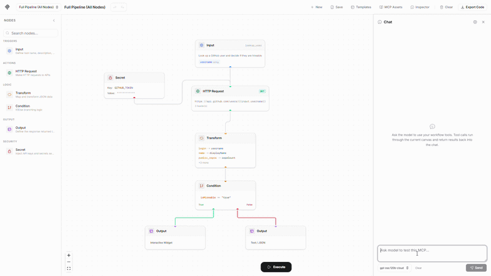

# mcp-flow

A visual, node-based platform for building and deploying MCP (Model Context Protocol) servers without writing code. Design tool workflows using a drag-and-drop editor, then export production-ready TypeScript servers compatible with Claude, ChatGPT, Cursor, and Copilot.



## Architecture

```
mcp-flow/
├── frontend/          Next.js 16 (App Router) + React 19 + @xyflow/react
│   ├── app/           Pages and global styles
│   ├── components/
│   │   ├── editor/    Flow editor, nodes, edges, panels, modals
│   │   └── ui/        shadcn/ui components
│   └── lib/           Zustand store, templates, utilities
├── backend/           NestJS + Prisma (PostgreSQL)
│   └── src/
│       └── workflow/  Execute, generate, and validate endpoints
└── plan.md            Full project roadmap
```

## Tech Stack

| Layer     | Technology                                            |
| --------- | ----------------------------------------------------- |
| Frontend  | Next.js 16, React 19, TypeScript                      |
| Canvas    | @xyflow/react (React Flow)                            |
| State     | Zustand (undo/redo history, localStorage persistence) |
| UI        | shadcn/ui (radix-nova), Tailwind CSS v4               |
| Icons     | Hugeicons                                             |
| Animation | Framer Motion                                         |
| Backend   | NestJS 11, Prisma, PostgreSQL                         |
| Target    | mcp-use (MCP server framework)                        |

## Features

### Node Types

- **Input** - Define tool name, description, and typed parameters (string, number, boolean) with required/optional and default values.
- **HTTP Request** - Configure method, URL, headers, and body with `{{input.param}}` and `{{secret.KEY}}` variable interpolation.
- **Transform** - Map fields between data shapes (`source.field -> target.field`) or run inline JS expressions.
- **Condition** - If/else branching based on field operators (equals, contains, gt, lt, exists, etc.) with true/false output handles.
- **Secret** - Inject environment variables and API keys securely. Values are masked in the UI and generated as `process.env["KEY"]`.
- **Output** - Choose between Text/JSON response or interactive Widget output.

### Editor

- n8n-style left sidebar with categorized, searchable, draggable node palette.
- Drag-and-drop nodes from palette onto canvas.
- Connection validation (prevents invalid wiring like output-to-output).
- Custom smooth-step edges with delete button on selection.
- Per-node execution status highlighting (running, success, error).
- MiniMap for canvas navigation.
- Undo/redo with keyboard shortcuts (Ctrl+Z, Ctrl+Y).
- Auto-save to localStorage with restore on reload.
- Inline-editable workflow name.
- Delete nodes via keyboard (Delete/Backspace) or config panel button.

### Templates

On first visit, a template picker dialog offers pre-built workflows:

- **Full Pipeline (All Nodes)** - Comprehensive showcase using all 6 node types: Input, Secret, HTTP, Transform, Condition, and branching Output.
- **Weather Lookup** - Fetch weather data with field transformation.
- **GitHub Repository Info** - Query the GitHub API with header configuration.
- **Authenticated API Proxy** - Secret-based auth token injection.
- **Random Joke** - Minimal input-to-output pipeline.

### Code Generation

Dynamic `mcp-use` server code generation:

- Topological sort of the graph to determine execution order.
- Generates `server.tool()` calls with Zod schemas from Input node parameters.
- Supports multiple tools per workflow (multiple Input nodes).
- Variable interpolation: `{{input.param}}`, `{{secret.KEY}}`, `{{field.path}}`.
- Graph validation before export (missing connections, empty URLs, orphan nodes).
- Downloadable `index.ts` and `package.json` with quick-start instructions.

### Execution

- Run workflows against real APIs directly from the editor.
- Per-node execution tracking with timing.
- Type-specific input controls in the run dialog (text, number, checkbox).
- Last-used parameter values remembered in localStorage.
- Generic JSON result viewer in the output panel.

### Live Connectivity

Expose your workflows as active MCP endpoints with a single click:

- **One-Click Live Mode**: Toggle the "Live" switch to spawn an independent, background MCP server for the current workflow.
- **Dynamic Port Allocation**: The backend automatically finds and manages free ports for active workflows.
- **SSE Endpoints**: Live servers are exposed via Server-Sent Events (SSE), compatible with standard MCP clients and the MCP Inspector.
- **Process Management**: Backend tracks and manages lifecycle for all live workflow processes (isolated using `ts-node`).
- **URL Persistence**: Live status and endpoints are persisted in the database, allowing servers to stay active across reloads.

## Getting Started

### Prerequisites

- Node.js 18+
- PostgreSQL (for backend persistence)

### Development

```bash
# Install dependencies
pnpm install

# Start both services
pnpm dev
# Or run individually:
cd frontend && pnpm run dev     # http://localhost:1528
cd backend && pnpm run dev      # http://localhost:2815
```

### API Endpoints

| Method | Path                 | Description                           |
| ------ | -------------------- | ------------------------------------- |
| POST   | `/workflow/execute`  | Execute a workflow graph              |
| POST   | `/workflow/generate` | Generate MCP server code              |
| POST   | `/workflow/validate` | Validate graph integrity              |
| GET    | `/workflow/:id/live` | Get live status and URL               |
| POST   | `/workflow/:id/live` | Toggle live mode (start/stop process) |

## Generated Server Example

The exported code uses the `mcp-use` framework:

```typescript
import { MCPServer, text, object, error } from 'mcp-use/server';
import { z } from 'zod';

const server = new MCPServer({
  name: 'mcp-flow-server',
  version: '1.0.0',
  description: 'Generated by MCP-Flow',
});

server.tool(
  {
    name: 'get_weather',
    description: 'Get current weather for a given city',
    schema: z.object({
      city: z.string().describe('City name'),
    }),
  },
  async (params) => {
    try {
      let data: any = { ...params };
      const response = await fetch(`https://wttr.in/${params.city}?format=j1`);
      if (!response.ok) {
        return error(`HTTP ${response.status}: ${response.statusText}`);
      }
      data = await response.json();
      return object(data);
    } catch (err: any) {
      return error(`Tool execution failed: ${err.message}`);
    }
  },
);

server.listen().then(() => console.log('MCP server running'));
```
